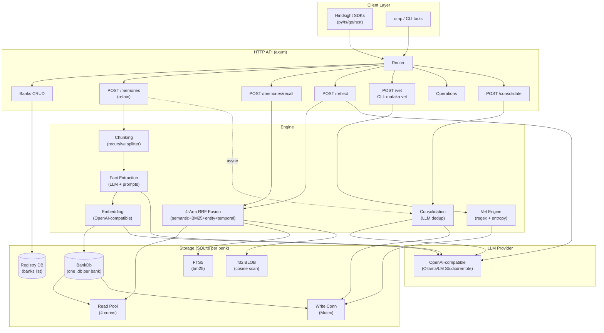

# mataka — Architecture & Upstream Analysis
## Architecture overview

**Data flow:**

1. **Retain**: Client → axum → vetting (ingress guard) → chunking → LLM extraction → embedding → BankDb (facts + FTS trigger + entity upsert) → async consolidation
2. **Recall**: Client → axum → 4-arm search (semantic cosine + BM25 FTS5 + entity co-occurrence + temporal) → RRF fusion → budget packing (tiktoken) → response
3. **Vet**: CLI/API → scan BankDb text/context/metadata → regex + entropy detection → quarantine or redact (4-copy: text + embed + FTS + history)

## Why Hindsight is heavy in local mode

Measured from source (hindsight-api-slim, v0.8.x):

1. **torch >= 2.6 (CPU)** — pulled in by sentence-transformers for the default local
   embeddings (`BAAI/bge-small-en-v1.5`) and the default local reranker
   (`cross-encoder/ms-marco-MiniLM-L-6-v2`, `DEFAULT_RERANKER_PROVIDER = "local"`).
   Torch runtime alone is typically 1–2 GB RSS. Upstream's own cross_encoder.py comments
   acknowledge local rerankers "allocate significant memory."
2. **Embedded PostgreSQL (pg0-embedded) + pgvector** — a full postgres server process
   per instance, plus asyncpg/psycopg2/SQLAlchemy/Alembic layers.
3. **Python service tree** — FastAPI + fastmcp + OTel (6 pinned packages) + litellm-adjacent
   provider SDKs (openai, anthropic, google-genai) all resident.
4. **Next.js control plane** — separate Node process in the all-in-one image.

None of these are required by the API contract.

## Replacement mapping

| Upstream | mataka | Note |
|---|---|---|
| PostgreSQL + pgvector | SQLite (WAL) + f32 BLOB embeddings | brute-force cosine to ~100k units; upgrade path: sqlite-vec ANN |
| ParadeDB/VectorChord BM25 | SQLite FTS5 `bm25()` | zero extra deps, porter tokenizer |
| Entity graph (PG tables) | entities + unit_entities + SQL joins | co-occurrence expansion arm |
| sentence-transformers/torch | OpenAI-compatible /embeddings (Ollama, LM Studio, remote) | feature-gated `ort` ONNX later; upstream already ships an OnnxEmbeddings path validating this |
| torch cross-encoder reranker | deferred; RRF-only MVP | ONNX ms-marco int8 ≈ 25 MB when added |
| litellm / provider SDKs | one OpenAI-compatible chat client | provider differences collapse behind /v1/chat/completions |
| FastAPI + uvicorn | axum + tokio | single static binary |
| Alembic migrations | idempotent schema DDL | versioned migrations when schema stabilizes |

## Recall pipeline (TEMPR analog)

Upstream fuses four retrieval arms with Reciprocal Rank Fusion, k=60, per-source candidate
caps, ordered [semantic, bm25, graph, temporal] (`engine/search/fusion.py`). mataka ports
that exactly (`src/engine/fusion.rs`), including per-arm score bookkeeping (semantic/keyword).
Upstream also has an alternative interleave fusion for dedup-style recall — trivial to add.

Budget levels map to per-arm candidate counts (low=20, mid=50, high=100 in MVP; calibrate
against upstream during differential testing). Results are packed to `max_tokens` with a
chars/4 estimator (swap for tiktoken-rs for exact parity).

## Retain pipeline

Upstream: 3-phase orchestrator — Phase 1 read-heavy pre-resolution (extraction, entity
resolution, ANN link precompute), Phase 2 transactional fact+link insert, Phase 3 post-commit
best-effort work, then async consolidation into observations.

mataka MVP: extraction (LLM, JSON mode, fence-tolerant for small local models) → batch
embed → insert facts (FTS via trigger) → entity upsert + links. Consolidation is the first
Tier-1 worker; upstream's consolidation prompts are 227 lines and MIT-licensed — port directly.

## Reflect

Upstream runs an agentic tool loop with source priority Mental Models → Observations → Raw
Facts, shaped by bank mission/directives/disposition. MVP collapses to recall + single
grounded generation with mission/disposition injected. Same request/response contract; the
loop is an internal upgrade invisible to clients.

## Fact-extraction quality is the moat — and the Looper hook

The lean stack's recall quality ceiling is set almost entirely by extraction quality, which is
LLM-dependent, not architecture-dependent. Upstream's fact_extraction.py is 2,728 lines,
mostly prompt engineering — MIT, portable. This is also the natural Looper measurement target:
extraction is a bounded, verifiable task (JSON out, schema-checkable, quality scorable against
a frontier-model reference) — exactly the shape of task the Ornith 9B minion harness measures.

## Differential testing plan

1. Fixture corpus: ~200 mixed retain payloads (conversations, docs, temporal facts).
2. Run upstream docker + mataka side by side, same LLM provider (pin model + temp 0).
3. Assert: response schemas validate against pinned openapi.json; recall@k overlap ≥ 0.8;
   entity sets ≈ equal; token budgets respected.
4. Run official SDK integration smoke tests (hindsight-clients/*) against mataka.

## Footprint measured (MVP, debug build, mock provider)

- Binary: 157 MB debug → ~12–15 MB expected release+LTO+strip
- RSS serving requests: **18.4 MB**
- With ONNX embeddings + int8 reranker in-process: est. 250–350 MB
- Upstream local mode: multi-GB (torch + embedded PG + Python + Node)
